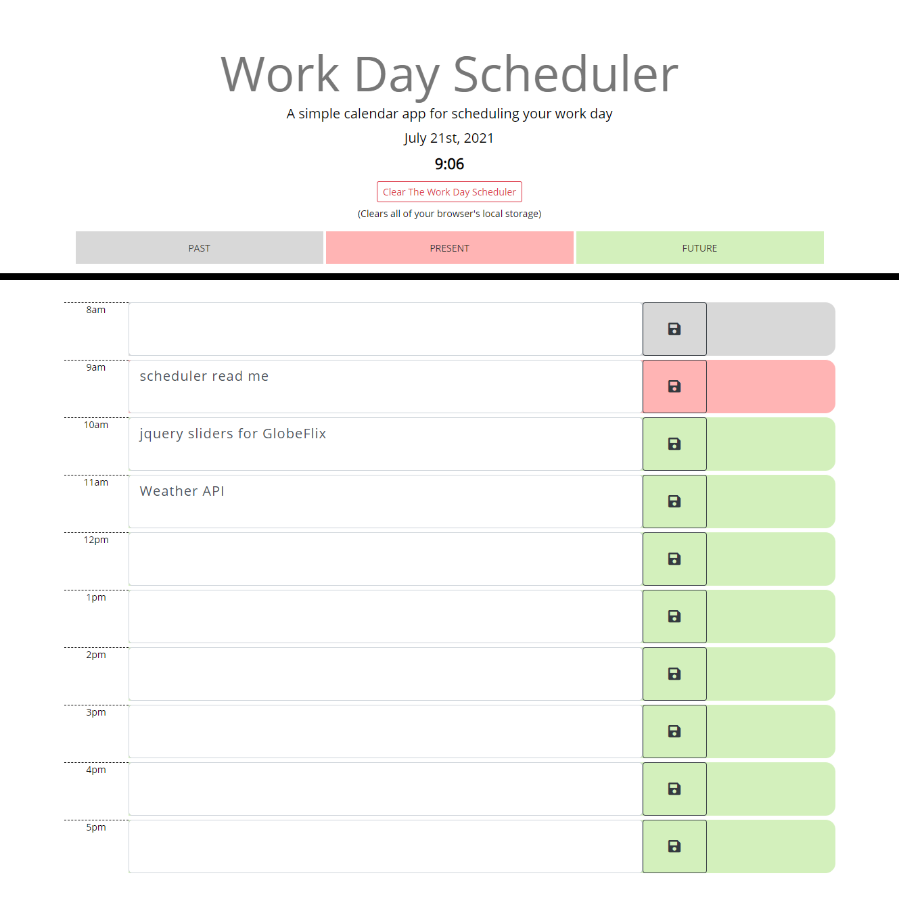

# scheduler

A simple calender app for scheduling your work day created with saving tasks to local storage, updating hours in real-time for past, present and future with current date and current hour.

# Work Day Calender
> Site example using Jquery to produce a secure password.
> Live site demo: [_Work_Scheduler_](https://brandon-stewart-rgb.github.io/scheduler/). 

## General Information

A site developed for the purpose of scheduling your day.

### Technologies Used

        * Javascript
        * Moment.js
        * Jquery
        * Gitbash
        * Github
        * Gitpages
        * GoFullPage
        * Visual Studio Code 

        

#### Screenshot
 
